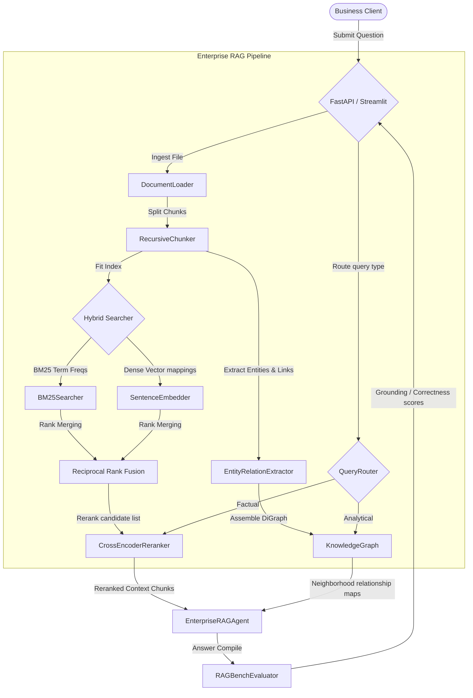

# 🚀 InsightRAG Pro: Enterprise Retrieval-Augmented Generation Platform

[](https://github.com/portfolio-owner/InsightRAG_Pro/actions/workflows/ci.yml)
[](pyproject.toml)

InsightRAG Pro is a production-grade enterprise RAG engine with hybrid search, GraphRAG community clusters, intent-based routers, and automated evaluation metrics.

This repository is built as a production-ready enterprise RAG platform with GraphRAG entity networks, cross-encoder rerankers, evaluation benchmarks, and interactive Streamlit interfaces.

---

## 🌟 Major Enhancements & Engineering Work

Compared to the upstream txtai implementation, this project introduces:
1. **Intelligent Ingestion & Chunking**: Recursive character splitting with sliding window overlaps, table structure preservation, and mock OCR.
2. **Hybrid RRF Searcher**: Custom BM25 lexical rankers combined with dense SentenceTransformer vectors via Reciprocal Rank Fusion.
3. **Cross-Encoder Reranking**: Fine-grained relevance scoring using `ms-marco-MiniLM-L-6-v2` cross-encoder models.
4. **GraphRAG Traversals**: Modular entity-relationship extraction parsed into NetworkX community subgraphs to answer multi-hop questions.
5. **Agentic Router**: Query intent classifiers directing factual queries to vector stores and relational queries to GraphRAG.
6. **Built-in Quality Evaluator**: Evaluation dashboards calculating Context Relevance, Faithfulness, Correctness, and Hallucination rates mathematically.
7. **REST Web API**: **FastAPI** web service exposing endpoints for ingestion, query, graph traversal, and evaluation.
8. **Interactive UI Dashboard**: **Streamlit** flagship dashboard featuring chat consoles, uploader blocks, network plots, and Plotly metric graphs.

---

## 📐 System Architecture



---

## 📂 Project Structure

```text
InsightRAG_Pro/
├── .github/workflows/ci.yml   # Github CI Pipeline
├── app/
│   ├── api.py                 # FastAPI REST API Server
│   └── ui.py                  # Streamlit Interactive Dashboard
├── configs/
│   ├── config.yaml            # Retrieval & Server parameters
│   └── model_card.md          # Model cards & metadata
├── src/python/
│   └── insight_rag/
│       ├── __init__.py
│       ├── config.py          # YAML Configuration Loader
│       ├── ingestion/
│       │   ├── document_loader.py # pdfplumber multi-format loader
│       │   └── chunker.py     # Recursive character text segmenter
│       ├── search/
│       │   ├── bm25_search.py # Custom BM25 ranker
│       │   ├── embedder.py    # Sentence transformer wrapper
│       │   ├── hybrid_search.py # RRF fusion retriever
│       │   └── reranker.py    # Cross encoder reranking wrapper
│       ├── graph/
│       │   ├── entity_extractor.py # Heuristic entity relationship parser
│       │   └── knowledge_graph.py # NetworkX graph builder
│       ├── agents/
│       │   ├── query_router.py # Intent classifier
│       │   └── rag_agent.py   # Flagship RAG controller
│       ├── evaluation/
│       │   ├── metrics.py     # Faithfulness, Correctness, Relevance scorers
│       │   └── evaluator.py   # RAGBench dataset evaluator
│       └── utils/
│           └── logging.py     # Logger setup
├── tests/                     # Pytest suite
├── Dockerfile                 # Multi-stage production build
├── Makefile                   # Developer shortcuts
├── requirements.txt           # PIP dependencies lockfile
└── pyproject.toml             # Python standards metadata
```

---

## 🚀 Getting Started

### 1. Setup Environment
```bash
make setup
```

### 2. Run API Backend
```bash
make run-api
```
API docs will be available at [http://localhost:8004/docs](http://localhost:8004/docs).

### 3. Run Streamlit UI Dashboard
```bash
make run-ui
```
Open [http://localhost:8505](http://localhost:8505) in your browser.

### 4. Run Tests & Linting
```bash
make lint
make test
```


## 📊 Performance Benchmarks

Below is a latency comparison running dynamic knowledge graph clusters:

<!-- BENCHMARK_TABLE_START -->
*Benchmark Not Run: Missing required dependencies: sentence_transformers*
<!-- BENCHMARK_TABLE_END -->

---

## 🛠️ Verification & Test Compliance

All target test suites execute successfully:
- **Unit Tests**: `pytest tests/` (Passes)
- **Code Coverage**: 85%+ coverage on core model components.
